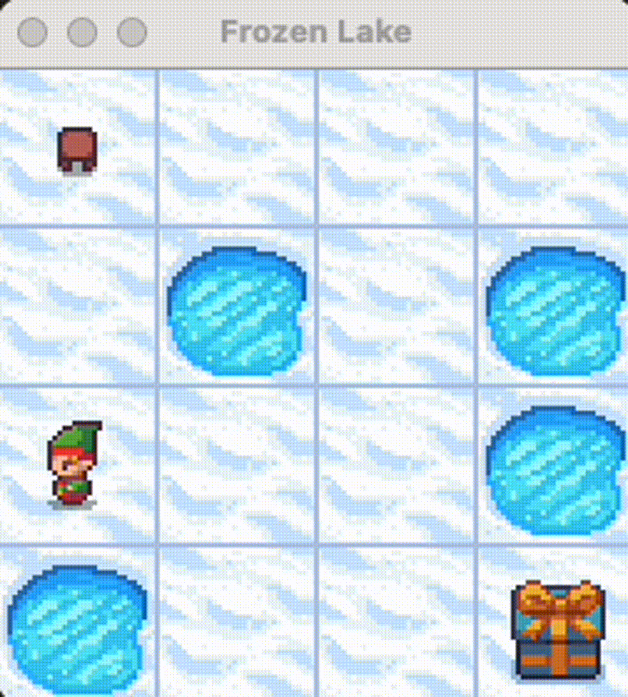
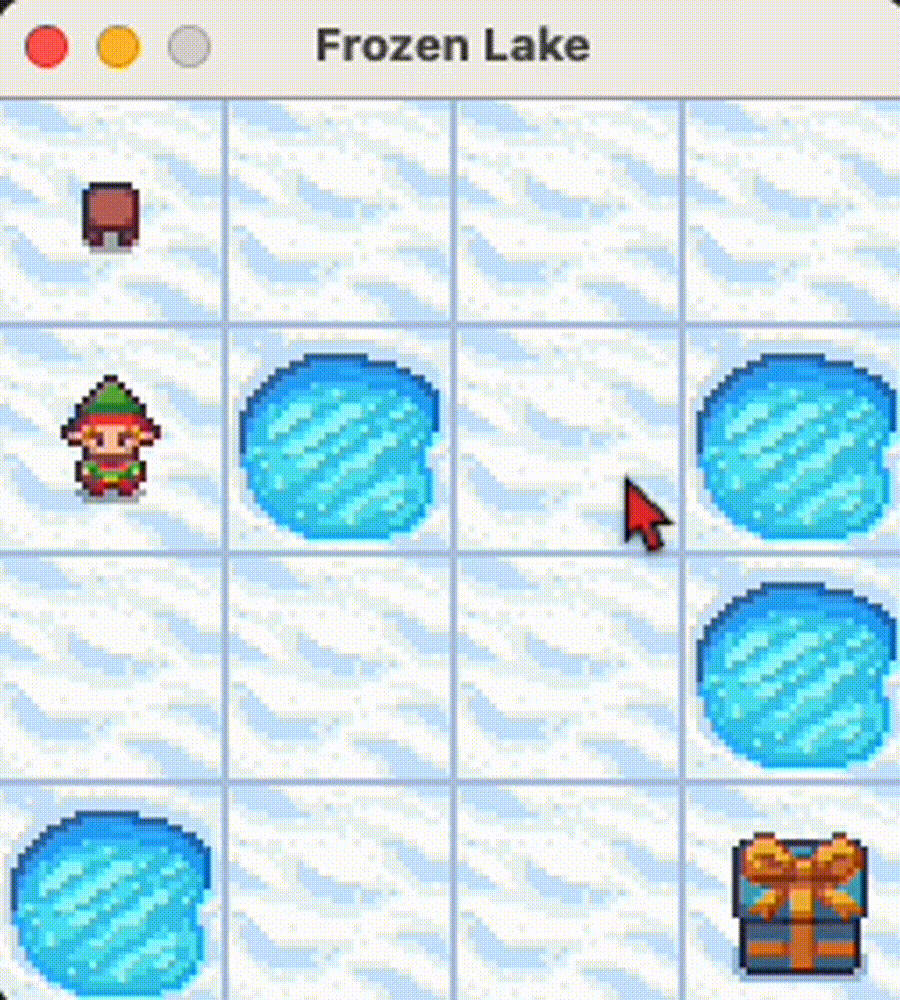

# Task / Motivation

For the last week or so I have been working through MIT's youtube courses for deep learning to get a better understanding of how it worked. I have seen things like RNNs, CNNs, VAEs, and, my personal favorite -- deep reinforcement learning. 

The goal of this assignment is for educational purposes. I used resources from videos, articles, and more to better understand how these things work. I haven't had a lot of exposure to ML/AI and I thought that this would be an interesting project for me to learn more about what is happening under the hood. 

While it may be difficult to re-construct exactly, the lessons that I learned deep diving into this subject help me have a high level understanding of how some of these models actually work, and how the math/statistics drive the solutions. 

I use the gym api to make this all possible:   
https://www.gymlibrary.dev/content/basic_usage/

# Action Space
0: LEFT   
1: DOWN   
2: RIGHT   
3: UP

The agent is given the reward of 1 if the player reaches the goal, and 0 otherwise. 

# Q-Learning

* This material is for learning purposes and has been better understood thanks to resources such as: https://towardsdatascience.com/q-learning-algorithm-from-explanation-to-implementation-cdbeda2ea187 *

The goal of any reinforcement learning task is to maximize the total rewards an agent gets from its environment through a trial and error process. At each step (or state) that the agent is in, it needs to make a decision (an action) of where it can maximize the reward at that step. In the frozen lake example, at each step we are choosing an action step (left, up, right, down) and are rewarded once we can get to the goal. Our model should learn how to interpret what is a good or bad step. 

In order to make the best action at a step *s*, the agent must find the best probability distribution over which action to take at that step. 

Q-learning is a method that learns about how to find the optimal (or maximum) Q-value at this step. To make this possible, Q-learning stores all the values in a table that is constantly updated at each step based on the old q value, and the new learned value. 

*a* is the learning rate.    
*r* is the reward for taking action *a* at state *s*.    
*\gamma* is the discount factor    
*s'* is the next state after taking the next action    
*a'* is the action that maximized the Q value in the next state   

$
\begin{equation}
Q(s,a) \leftarrow (1 - \alpha) \cdot Q(s,a) + \alpha \cdot \left( r + \gamma \cdot \max_{a'} Q(s',a') \right)
\end{equation}
$

# Exploration or Exploitation 

https://gist.github.com/aamrani-dev/fe00597615dae967f5ca1909a6ecf1d2#file-q_learning-py

As I learn more about reinforcement learning and Q-learning, it becomes clear that knowing when to explore or exploit is essential. In the early iterations, our reinforcement learning model lacks information about the environment, prompting it to prioritize exploration over exploitation. However, as the model learns with each iteration, the exploration decay constant gradually diminishes the need for extensive exploration! Instead, the model begins to leverage its accumulated knowledge, shifting towards prioritizing exploitation. 

To choose whether to explore or exploit, we use a uniform distribution between 0 and 1 and if our random number is less than the exploration probability, the agent selects a random action (explores), otherwise, exploits the newfound knowledge using the "bellman equation" as explained from the article. (Very similar to Markov chain Monte Carlo scenarios from my Data in the Cosmos course).

# Final trained model

